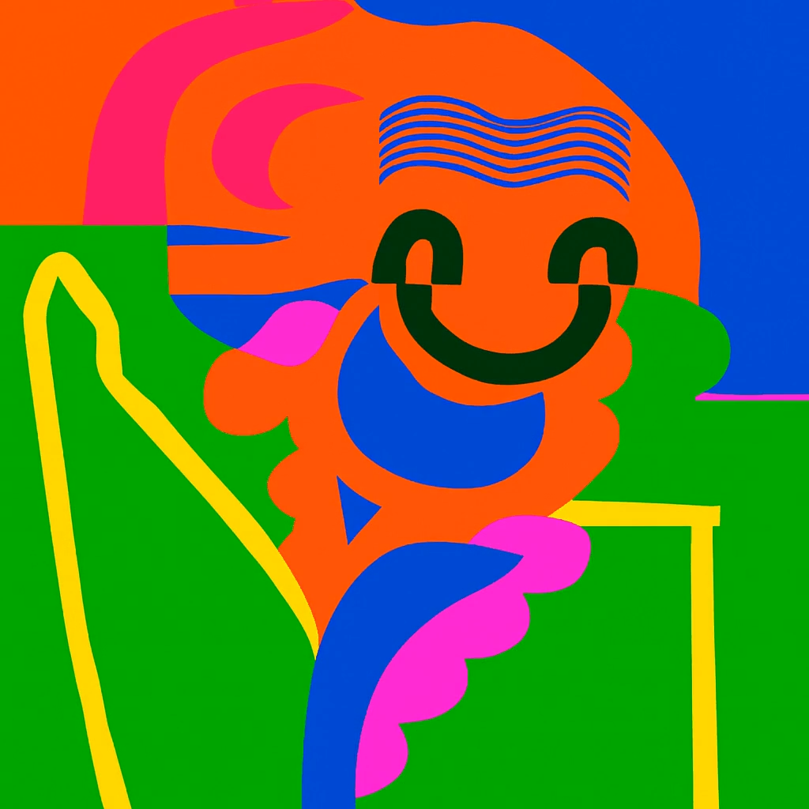
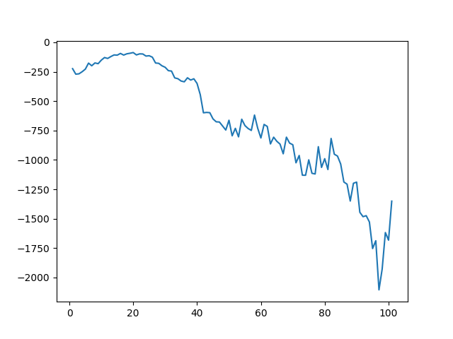
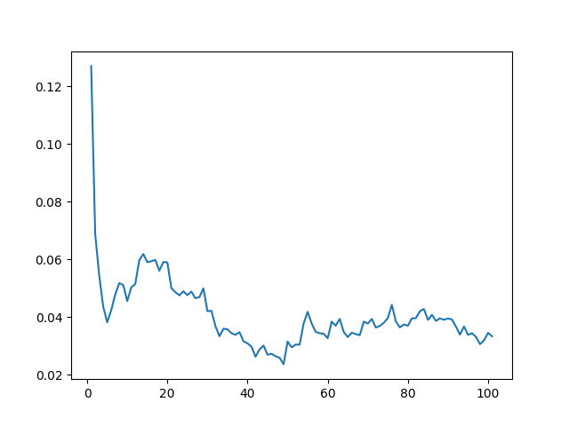
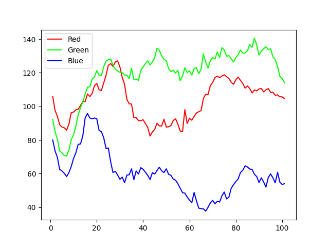
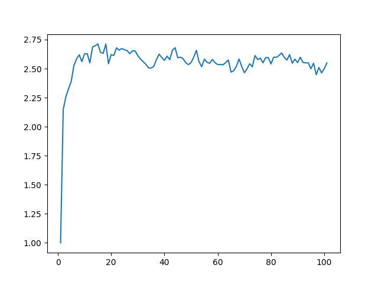

# Recursive Image Analysis Research



## Overview
This project investigates the degradation and evolutionary patterns of digital images when subjected to recursive processing (save/load/process cycles). By iteratively processing an image and analyzing the results, we observe how digital information decays, stabilizes, or transforms over time.

## Key Visualizations & Interpretation

### 1. Structural Similarity (SSIM)

**Interpretation:**
The Structural Similarity Index (SSIM) measures the perceptual difference between two images.
- **To Original (Blue):** Shows a sharp initial drop (~0.35), indicating that the first few iterations cause the most significant deviation from the source.
- **To Previous (Orange):** Hovers around 0.90, suggesting that while the image is constantly changing, each step is relatively similar to the one before it. The system rapidly finds a "path" of degradation.

### 2. Information Content (Entropy)

**Interpretation:**
Entropy quantifies the amount of "information" or randomness in the image.
- We observe a **significant decrease** in entropy (from ~-200 to ~-1350).
- This indicates a massive loss of detail and texture. The image is becoming "simpler"—likely smoothing out into large patches of uniform color, losing high-frequency noise and texture.

### 3. Edge Density

**Interpretation:**
This metric tracks the proportion of the image that contains edges (using a Sobel filter).
- Tracking edge density confirms the entropy findings: as texture is lost, the number of detectable edges likely diminishes or stabilizes into a few strong contours, while subtle details vanish.

### 4. Color Drift

**Interpretation:**
We track the average Red, Green, and Blue channel intensities over iterations.
- **Green Shift:** The Green channel intensity increases (92 $\to$ 114).
- **Blue Loss:** The Blue channel intensity drops significantly (80 $\to$ 54).
- **Red Stability:** The Red channel remains relatively stable.
This suggests the recursive algorithm (or compression artifacts) has a bias that drives the color balance towards cooler, green-dominant tones while suppressing blue information.

### 5. SSCI (Stability-to-Change Index)

**Interpretation:**
This computed metric ($SSIM_{prev} / SSIM_{orig}$) represents the ratio of local stability to global drift. A rising trend would indicate that the image is stabilizing locally even as it drifts further from the original.

## Research Findings
Based on the analysis of 100+ iterations:
1.  **Convergence to Simplicity:** The system does not devolve into chaotic noise. Instead, it converges towards a simplified, lower-entropy state.
2.  **The "Green-Shift" Phenomenon:** There is a deterministic drift in color space. The specific processing chain favors the preservation and amplification of Green channel information at the expense of Blue.
3.  **Rapid Initial Decay:** The majority of "original" structural information is lost in the very first few generations. Subsequent changes are more gradual, "polishing" the artifacts introduced in the early steps.

## Usage
To replicate this analysis:

1.  **Install Dependencies:**
    ```bash
    pip install -r requirements.txt
    ```

2.  **Run Analysis:**
    Execute the Python scripts to generate new data and graphs:
    ```bash
    python analysis_ssim.py
    python analysis_entropy.py
    python analysis_color_drift.py
    python analysis_edges.py
    python analysis_ssci.py
    ```

## Structure
- `images/`: Directory containing the recursive generation frames.
- `graphs/`: Generated visualization plots.
- `results/`: CSV data corresponding to the graphs.
